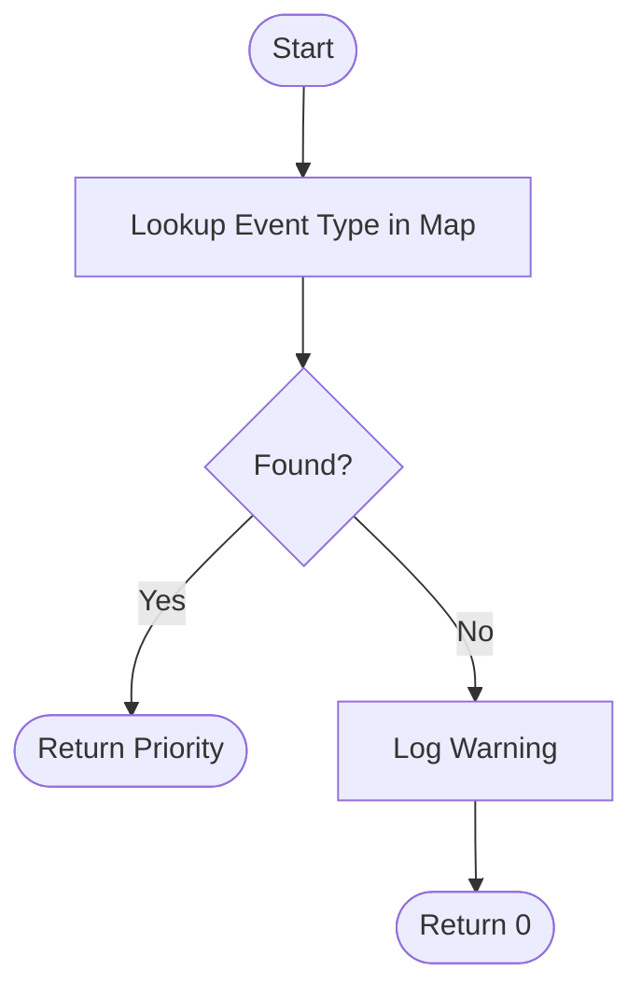

<!--this is a comment -->

# SIEM Event Log File Processor Flowchart

## SIEM Event Log File Processor State Diagram

## Pure Functions Diagram

### Read Events from File

**File:** `src/basic_functions/read_events_from_file.py`
**Test:** `tests/test_read_events_from_file.py`

### Normalize Event Datetime

**File:** `src/basic_functions/normalize_event_datetime.py`
**Test:** `tests/test_normalize_event_datetime.py`

### Assign Priority by Event Type

**File:** `src/basic_functions/assign_priority_by_event_type.py`
**Test:** `tests/test_assign_priority_by_event_type.py`

### Add Threat Level by Priority

**File:** `src/basic_functions/add_threat_level_by_priority.py`
**Test:** `tests/test_add_threat_level_by_priority.py`

### Combine Read File Normalize Timestamp Add Threat Level

**File:** `src/complex_processor_functions/combined_processor_functions.py`
**Test:** `tests/test_combine_read_file_normalize_timestamp_add_threat_level.py`

## Test Diagram

### Test Functions Diagram

### Test Data Generator Diagram

