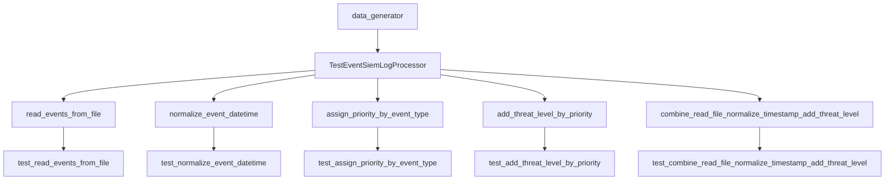
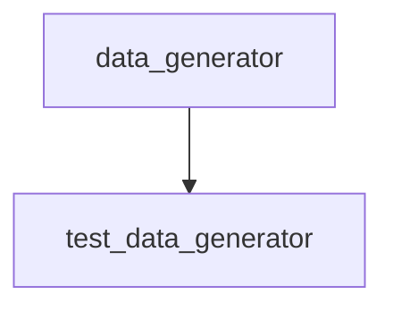

# Unit Tests (`tests/`)

`test_read_events_from_file.py`
`test_normalize_event_datetime.py`
`test_add_threat_level_by_priority.py`
`test_combine_read_file_normalize_timestamp_add_threat_level.py`

## Test Criteria

- Expected output matches actual output (using `assert`).
- Input validation and error handling.
- Robustness against corrupted data.

## Test Runner

- Uses `unittest.main()` to execute tests when run directly.

## Test Data

- The test logic is isolated from the main application logic, and only focus on it, for that reason and also to avoid any side effects such as hardcoded data, the test data is generated using the `helpers/data_generator.py` module.
- Consumes test data from `helpers/data_generator.py.generate_siem_event_csv` and `helpers/data_generator.py.generate_test_data_with_edge_cases`

## Test Class

`helpers/test.py.TestEventSiemLogProcessor` (inherits from `unittest.TestCase`) manage the test process, creating a test environment, consume the test data, run the tests and clean up the test environment.

## Test Diagram

### Test Functions Diagram



### Test Data Generator Diagram



<details><summary>Packages and Modules Imported:</summary>

- `unittest`: For unit testing.
- `os`: For file operations.
- `shutil`: For high-level file operations.

</details>

<details><summary>Methods:</summary>

- **setUp:**  
  Prepares test environment, creates temp directory and sample data as string with valid and inavalid options.
- **tearDown:**  
  Cleans up test environment, removes temp directory.

</details>

### Individual Tests and Steps

**Packages and Modules Imported:**

- Functions from `src/basic_functions_files` and `src/complex_processor_functions` that are going to be teasted:  
  `read_events_from_file`, `normalize_event_datetime`, `add_threat_level`, `process_events_read_normalize_add_threat_level`.

#### test_read_events_from_file

Validate the `read_events_from_file` function that reads and  parsing the events from a file

<details><summary>Steps:</summary>
  1. Create a sample event log file with known data.
  2. Call `read_events_from_file` with the file path.
  3. Assert that the returned list matches the expected event dictionaries.
  4. Check handling of empty or malformed rows.
</details>

#### test_normalize_event_datetime

Validate the `normalize_event_datetime` function that converts the datetime format to UTC
<details><summary>Steps:</summary>
  1. Create sample event dictionaries with various datetime formats.
  2. Call `normalize_event_datetime` for each event.
  3. Assert that the `datetime` field is normalized to `YYYY-MM-DD HH:MM:SS` UTC.
  4. Test handling of invalid or missing datetime values.
</details>

#### test_assign_priority_by_event_type

Validate the `assign_priority_by_event_type` function that assigns a priority based on the event type.
<details><summary>Steps:</summary>
  1. Call `assign_priority_by_event_type` with known event types.
  2. Assert that the returned priority matches the expected value (1-5).
  3. Test handling of unknown event types (should return 0).
</details>

#### test_add_threat_level_ by_priority

Validate the `add_threat_level_by_priority` function that assigns a threat level based on the specified security priority.
<details><summary>Steps:</summary>
  1. Create sample event dictionaries with different priority values.
  2. Call `add_threat_level_by_priority` for each event.
  3. Assert that the `threat_level` field matches the expected mapping.
  4. Test handling of unknown or invalid priority values.
</details>

#### test_combine_read_file_normalize_timestamp_add_threat_level

Validate the `combine_read_file_normalize_timestamp_add_threat_level` function which calls the previous functions (read_events_from_file, normalize_event_datetime, add_threat_level_by_priority).
Veify the numbers of processed events.

<details><summary>Steps:</summary>
  1. Create a sample event log file with mixed data.
  2. Call `process_events_read_normalize_add_threat_level` with the file path.
  3. Assert that the returned list contains events with normalized datetime and correct threat level.
  4. Test handling of event limits and corrupted data.
</details>

**Command to run the test:**

**1. Move to the root directory of the project:**
>If you are in the root directory of the project, you can skip this step.

```bash
cd /home/user/siem_event_log_file_processor/
```

**2. Run all tests:**

There are two ways to run the tests using Unittest for quick tests or Pytest for more detailed tests using the verbose option as `-v`.
Above is going to be show the commandas for the different options (on each command indicated), Unittest is the default option.

- Using Pytest:

```bash
python3 -m pytest tests/ -v
```

>Above you are going to see the two options to run the tests, at first using Unittest and at second using Pytest.

**3. Run specifics test:**

**test_read_events_from_file**

```bash
python3 -m tests.test_read_events_from_file
```

```bash
python3 -m pytest tests/test_read_events_from_file.py -v
```

**test_normalize_event_datetime**

```bash
python3 -m tests.test_normalize_event_datetime
```

```bash
python3 -m pytest tests/test_normalize_event_datetime.py -v
```

**test_assign_priority_by_event_type**

```bash
python3 -m tests.test_assign_priority_by_event_type
```

```bash
python3 -m pytest tests/test_assign_priority_by_event_type.py -v
```

**test_add_threat_level_by_priority**

```bash
python3 -m tests.test_add_threat_level_by_priority
```

```bash
python3 -m pytest tests/test_add_threat_level_by_priority.py -v
```

**test_combine_read_file_normalize_timestamp_add_threat_level**

```bash
python3 -m tests.test_combine_read_file_normalize_timestamp_add_threat_level
```

```bash
python3 -m pytest tests/test_combine_read_file_normalize_timestamp_add_threat_level.py -v
```
