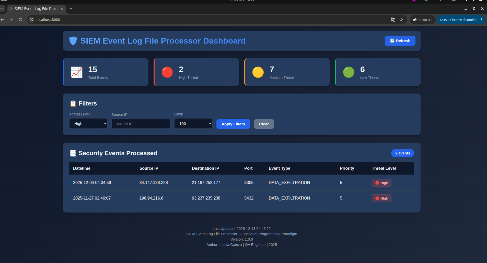
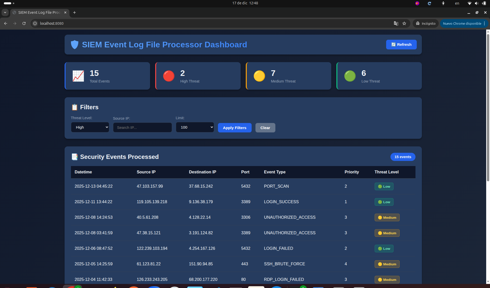

# SIEM Event Log File Processor

This project involves creating a Python program to automate actions for checking log information on a security monitoring program within a network. The program processes security events archived in a specific log file as input, following a defined format.

## Quick UI View

<p align="center">

</p>
<p align="center">

</p>

The program is built using the Functional Programming Paradigm intented to:

### Tech Stack used for the Web UI

- Flask            >=3.0.0 (for web UI)
- HTML, CSS, JS    (for web UI)

## Using the Web UI

To use the Web UI you can fallow the next steps:

1. Clone the repository (or download the zip file):

```bash
git clone https://github.com/letyPG/siem_event_log_file_processor.git
```

2. Create a virtual environment:

```bash
python3 -m venv venv
```

3. Activate the virtual environment:

```bash
source venv/bin/activate
```

4. Install the requirements:

```bash
pip install -r requeriments.txt
```

5. Run the Web UI (Optional):

```bash
cd ui
PORT=8000 python3 app.py
```

Then open your browser to `http://localhost:8000` to access the dashboard.

6. Open a new terminal and Run the demo:

```bash
python3 -m venv venv
source venv/bin/activate
pip install -r requeriments.txt
```

```bash
python3 -m demo.demo_event_siem_log_processor
```

>For this project was used python3, if you are want to use a different version, please use the current version of python and you can be able to run the commands without any issue, for example instead of `python3` you can use `python`.

----

## Web UI Dashboard (`ui/`)

A modern web-based dashboard for visualizing and monitoring SIEM events in real-time.

### Features

**Statistics Dashboard**

- Total events count
- Threat level distribution (High, Medium, Low)
- Last updated timestamp
- Real-time refresh capability

**Advanced Filtering**

- Filter by threat level
- Search by source IP address
- Adjustable result limits (50/100/200/500)
- Clear filters option

**Event Table**

- Color-coded threat levels (🔴 High, 🟡 Medium, 🟢 Low)
- Sortable columns
- Responsive design
- Smooth animations

**Modern and Simple Design**

- Professional dark theme
- Card-based layout
- Gradient headers
- Micro-animations

### Running the UI

**1. Start the server:**

```bash
cd ui
python3 app.py
```

**Stop the server:**

```bash
Ctrl+C
```

### API Endpoints

The UI provides RESTful API endpoints for programmatic access:

**GET `/api/events`** - Get all events or filtered events

- Query params: `threat_level`, `source_ip`, `limit`

**GET `/api/events/stats`** - Get event statistics

- Returns total counts and threat distribution

**GET `/api/events/recent`** - Get recent events

- Query param: `limit` (default: 10)

### Architecture

The UI follows MVC (Model-View-Controller) pattern:

- **Model** (`models/event_model.py`) - Data handling and business logic
- **View** (`views/templates/dashboard.html`) - HTML template and presentation
- **Controller** (`routes/event_routes.py`) - Route handlers and API logic

### Integration

The UI integrates seamlessly with the existing SIEM processor:

- Reads from `processed_events.json` generated by the demo or processing functions
- Uses the same data structures and threat level mappings
- Can be extended to trigger event processing via API
